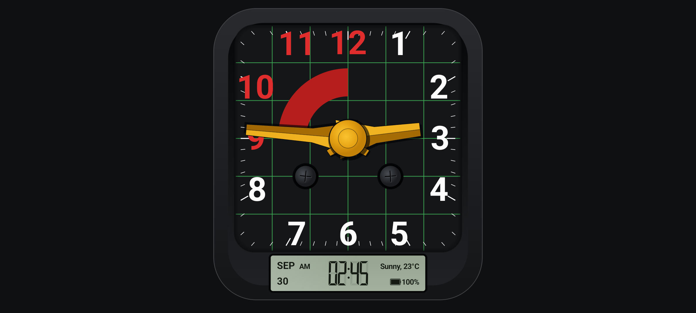

# 🏎️ MTC-Crock (エムティーシー・クロック)

80年代前半の国産クラシックミニバイクのスピードメーターをモチーフにした、常時点灯対応の高級感溢れるAndroid置き時計アプリケーションです。  
不要になったAndroidスマートフォンを高品質なインテリア置き時計として再利用できます。



---

## 📥 最新のビルド済み APK ダウンロード

本リポジトリでビルドされた最新の Android アプリケーション（APKファイル）は、以下のリンクから直接スマートフォンやタブレットへダウンロードしてインストールすることができます。

### 🚀 **[MTC-Crock-v1.0.apk を直接ダウンロードする](https://github.com/iwa-kasoutuuuuuka/MTC-Crock/raw/main/MTC-Crock-v1.0.apk)**

> [!TIP]
> スマートフォンからこのリンクをタップするだけで、直接インストールパッケージ（.apk）を取得可能です。インストール時に「不明なソースからのアプリを許可」を有効にしてください。

- 📂 **[リポジトリ内のファイル一覧からダウンロード](./MTC-Crock-v1.0.apk)**

---

## 🌟 主な特徴 & デザイン仕様

### 1. 🏍️ レトロ＆メタリック・スピードメーターデザイン
- **国産クラシックバイクのメーター造形を極限まで追求**
  - マットブラック角丸ベゼル × ダークチャコール文字盤 × **完全正方形エメラルドグリーングリッド（縦5本×横5本、各辺6等分）**。
  - **外周 1〜12 時表示**: 1〜8時はホワイト太字 / **9〜12時は鮮やかなレッド太字**（太く力強いボールドサンセリフ書体）。
  - **9時〜12時 速度警告赤帯（90度扇形アーチ）**:
    - 数字「9」「10」「11」「12」と**一切重ならない独立した幾何学設計**。
    - 9時側は水平カット、12時側は中央縦線に沿って垂直カット。
    - 数字と赤帯の間に黒い空間と緑のグリッド線が美しく通る絶妙な配置。
  - **マスタードイエロー 3D アナログ針 & センターハブ**:
    - 針の中央稜線（リッジ）によるハイライトとシャドウ（山型3D断面）。
    - センター丸型ハブキャップの背後・斜め下左右に突き出る**二股爪状ウィングパーツ**を忠実に再現。
  - **固定ボルト（2本）**:
    - 下から2本目（中央線から1マス下）の水平グリッド線上に左右対称配置。
    - 金属感のあるリアルなグラデーションと立体的なプラス頭十字スリット。

- **トリップメーター風 デジタル液晶表示部 (LCD小窓)**
  - ベゼル最下部にインセット成型されたレトロTN液晶（オリーブセピア色基板）。
  - **左ブロック**: 月（英語3文字 `OCT` 等）、日（2桁 `26` 等）、`AM/PM`。
  - **中央ブロック**: 肉太7セグメントデジタル時刻（薄い消灯ゴースト `88:88` 付き）。
  - **右ブロック**: 英語天気コンディション＋気温（例: `Sunny, 72°F`）および **ベクター液晶バッテリーアイコン＋残量%**。

### 2. ⚡ 軽量 & 60fps スムーズ描画
- **Compose Canvas による60fps滑らかな針移動**
- 不要な再描画を完全に排除した Battery-friendly 設計。

### 3. 🛡️ 有機EL (OLED) 焼き付き防止 (Burn-in Protection)
- 5分ごとに時計全体の描画座標を数ピクセルランダムオフセット（ピクセルシフト）。
- 定期的な色/トーン微調整。
- 夜間自動減光（ダークトーン化）。

### 4. 📺 全画面・スリープ禁止・横画面固定
- 常時点灯 (`FLAG_KEEP_SCREEN_ON`)。
- ステータスバー / ナビゲーションバー完全非表示 (`Immersive mode`)。
- 横画面固定 (`Landscape`)。

### 5. 👆 フル画面マルチジェスチャー
- **右スワイプ**: 設定画面を表示
- **左スワイプ**: 詳細天気画面を表示
- **上下スワイプ**: 画面明るさを手動調整 (0〜100% 数秒間オーバーレイ表示)
- **長押し**: クイックメニューダイアログを表示
- **ダブルタップ**: いつでも時計画面に直ちに復帰

### 6. ⛅ 天気 & ⏰ NTP時刻同期
- **Wi-Fi接続時自動時刻同期**: NTPサーバー (`pool.ntp.org`) と通信し、ミリ秒単位で内部時計を自動補正。
- **リアルタイム天気**: Open-Meteo REST API（完全無料・登録不要）より最新の天気・気温・湿度・降水確率・風速を取得。
- **オフライン対応**: Wi-Fi非接続時は直前のキャッシュデータを保持し、時計機能は完全スタンドアロンで安定動作。

### 7. 🔋 バッテリー & 🌡️ センサー表示 / スマート充電管理
- バッテリー残量(%)、充電中アイコン、バッテリー温度(°C / °F)を表示。
- 室温センサー搭載端末では室温を表示。
- スマート充電制御対応端末では 80%で充電停止 / 75%で充電再開。

### 8. ⚙️ 設定画面 & 単位切替 (°C / °F)
- **温度単位選択**: **摂氏 (`°C`)** と **華氏 (`°F`)** をワンタップ切替。
- **表示ON/OFF**: 曜日、日付、バッテリー、天気の表示/非表示。
- **カラーテーマ**: `SPORT` (黒×赤), `RACING` (黒×青), `CLASSIC` (黒×緑) の3種類。
- **昼夜自動明るさ制御**: 昼 (07:00〜19:00, 100%) / 夜 (19:00〜07:00, 20%) の時刻および輝度設定。


---

## 🛠️ 開発環境 & 仕様

- **言語**: Kotlin
- **UI**: Jetpack Compose (Material3)
- **Min SDK**: 26 (Android 8.0 以上)
- **Target SDK**: 36
- **主要ライブラリ**: Preferences DataStore, Retrofit2, Gson, Coroutines

---

## 🚀 ビルド & 開発手順

Android Studio または Gradle CLI を使用してビルドできます。

```bash
# クローン
git clone https://github.com/iwa-kasoutuuuuuka/MTC-Crock.git
cd MTC-Crock

# デバッグAPKのビルド
./gradlew assembleDebug

# ユニットテストの実行
./gradlew test

# 端末 / エミュレータへのインストール
./gradlew installDebug
```

---

## 📄 ライセンス

Copyright (c) 2026 MTC-Crock Project.
