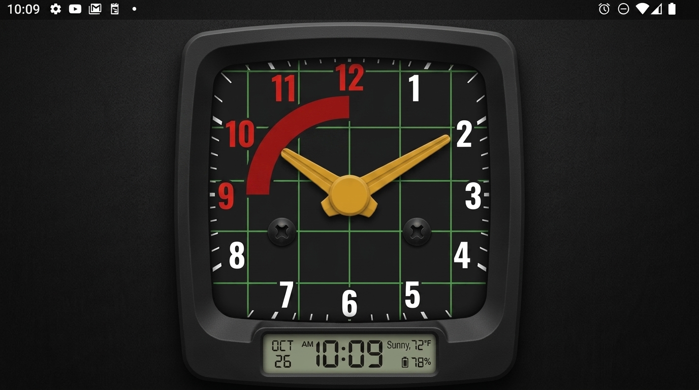
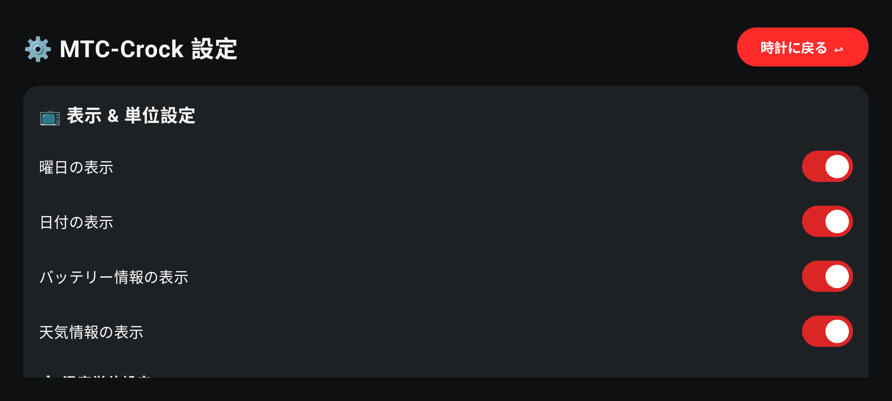

# 🏎️ MTC-Crock (エムティーシー・クロック)

80年代〜90年代の国産クラシックバイク（NIPPON SEIKI 製）スピードメーターをモチーフにした、常時点灯対応の高級感溢れるAndroid置き時計アプリケーションです。  
不要になったAndroidスマートフォンを高品質なインテリア置き時計として再利用できます。



---

## 📱 APK の直接ダウンロード・インストール

ビルド済みのAPKファイルを本リポジトリに同期・公開しています。以下のリンクからダウンロードして、Android端末に直接インストールしてご利用いただけます。

- 🚀 **[MTC-Crock-v1.0.apk (デバッグビルド済みAPK)](./MTC-Crock-v1.0.apk)**

---

## 🌟 主な特徴 & 機能

### 1. 🏍️ レトロ＆メタリック・スピードメーターデザイン
- **NIPPON SEIKI 製バイクスピードメーターを完全再現**
  - マットブラック角丸ベゼル × ダークチャコール文字盤 × 薄緑色格子（ネオングリッド線）。
  - **外周 1〜12 時表示**（1〜8時はホワイト太字 / **9〜12時は赤帯インジケーターグラフィック上のレッド太字**）。
  - 鮮やかなマスタードイエローの太いアナログ針（時針・分針）と中央イエローハブキャップ。
  - 文字盤下部の黒ネジ（プラス頭スリット）とスッキリしたクリア文字盤（`km/h`なし）。
- **トリップメーター風 デジタル液晶表示部 (LCD小窓)**
  - 針の中心ハブの直下に水平配置。
  - 西暦日付（`YYYY/MM/DD`）、曜日、`AM/PM`、天気アイコン・気温、バッテリー残量(%)・温度をスマート表示。

### 2. ⚡ 軽量 & 60fps スムーズ描画
- **Compose Canvas による60fps滑らかな針移動**
- 不要な再描画を完全に排除した Battery-friendly 設計。

### 3. 🛡️ 有機EL (OLED) 焼き付き防止 (Burn-in Protection)
- 5分ごとに時計全体の描画座標を数ピクセルランダムオフセット（ピクセルシフト）。
- 定期的な色/トーン微調整。
- 夜間自動減光（ダークトーン化）。

### 4. 📺 全画面・スリープ禁止・横画面固定
- 常時点灯 (`FLAG_KEEP_SCREEN_ON`)。
- ステータスバー / ナビゲーションバー完全非表示 (`Immersive mode`)。
- 横画面固定 (`Landscape`)。

### 5. 👆 フル画面マルチジェスチャー
- **右スワイプ**: 設定画面を表示
- **左スワイプ**: 詳細天気画面を表示
- **上下スワイプ**: 画面明るさを手動調整 (0〜100% 数秒間オーバーレイ表示)
- **長押し**: クイックメニューダイアログを表示
- **ダブルタップ**: いつでも時計画面に直ちに復帰

### 6. ⛅ 天気 & ⏰ NTP時刻同期
- **Wi-Fi接続時自動時刻同期**: NTPサーバー (`pool.ntp.org`) と通信し、ミリ秒単位で内部時計を自動補正。
- **リアルタイム天気**: Open-Meteo REST API（完全無料・登録不要）より最新の天気・気温・湿度・降水確率・風速を取得。
- **オフライン対応**: Wi-Fi非接続時は直前のキャッシュデータを保持し、時計機能は完全スタンドアロンで安定動作。

### 7. 🔋 バッテリー & 🌡️ センサー表示 / スマート充電管理
- バッテリー残量(%)、充電中アイコン、バッテリー温度(°C / °F)を表示。
- 室温センサー搭載端末では室温を表示。
- スマート充電制御対応端末では 80%で充電停止 / 75%で充電再開。

### 8. ⚙️ 設定画面 & 単位切替 (°C / °F)
- **温度単位選択**: **摂氏 (`°C`)** と **華氏 (`°F`)** をワンタップ切替。
- **表示ON/OFF**: 曜日、日付、バッテリー、天気の表示/非表示。
- **カラーテーマ**: `SPORT` (黒×赤), `RACING` (黒×青), `CLASSIC` (黒×緑) の3種類。
- **昼夜自動明るさ制御**: 昼 (07:00〜19:00, 100%) / 夜 (19:00〜07:00, 20%) の時刻および輝度設定。



---

## 🛠️ 開発環境 & 仕様

- **言語**: Kotlin
- **UI**: Jetpack Compose (Material3)
- **Min SDK**: 26 (Android 8.0 以上)
- **Target SDK**: 36
- **主要ライブラリ**: Preferences DataStore, Retrofit2, Gson, Coroutines

---

## 🚀 ビルド & 開発手順

Android Studio (Ladybug以降) または Gradle CLI を使用してビルドできます。

```bash
# クローン
git clone https://github.com/iwa-kasoutuuuuuka/MTC-Crock.git
cd MTC-Crock

# デバッグAPKのビルド
./gradlew assembleDebug
```

---

## 📄 ライセンス

Copyright (c) 2026 MTC-Crock Project.
